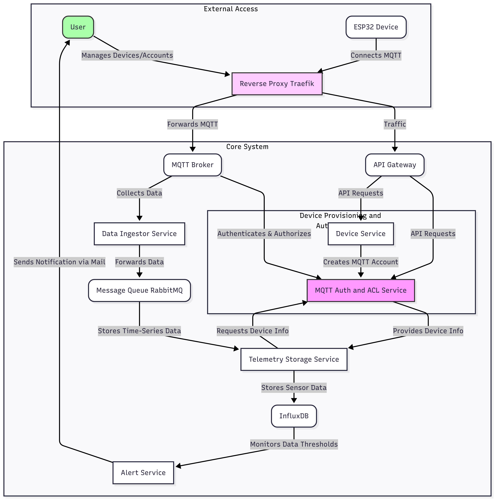

# IoT Sensor Data Collection and Alerting System

This document outlines the architecture and operational flow of the IoT sensor data collection and alerting system. The system is designed to securely collect telemetry data from ESP32 devices, process and store it efficiently, and generate alerts based on predefined thresholds.

## System Architecture Overview

The system is composed of several interconnected services and databases, orchestrated to handle data from device registration to alerting.

## How the System Works

The system's operation can be broken down into three main phases: **Device Provisioning and Authentication**, **Data Ingestion and Storage**, and **Alerting**. All external interactions are managed through a central **Reverse Proxy (Traefik)**.

### 1. Device Provisioning and Authentication

This phase describes how ESP32 devices are registered and obtain the necessary credentials to connect to the system.

* **User Interaction:** A `User` (e.g., an administrator or device owner) initiates the process by interacting with the system's APIs via the `Reverse Proxy (Traefik)`. These API requests are then routed to the `API Gateway`.
* **Account Creation:** The `API Gateway` forwards the API requests (e.g., for creating a new device or user) to the `Device Service`.
* The `Device Service` then collaborates with the `MQTT Auth and ACL Service` to create a unique MQTT account (username, password, client ID) for the new ESP32 device.
* **Credential Storage:** The `MQTT Auth and ACL Service` securely stores these MQTT account details in the `Auth and ACL DB (PostgreSQL)`.
* **Manual Provisioning:** The created MQTT credentials are then provided by the system back to the `User`. It is the `User`'s responsibility to manually configure the `ESP32 Device` with these credentials, allowing it to connect to the MQTT broker.

### 2. Data Ingestion and Storage

Once an ESP32 device is provisioned, it can start sending telemetry data.

* **Secure Connection:** The `ESP32 Device` connects to the `MQTT Broker` by routing its connection through the `Reverse Proxy (Traefik)`. This ensures all incoming connections are securely managed and load-balanced.
* **Data Collection:** The `MQTT Broker` receives telemetry data from all connected ESP32 devices.
* The `Data Ingestor Service` actively collects this data from the `MQTT Broker`.
* **Message Queuing:** The `Data Ingestor Service` forwards the raw telemetry data to a `Message Queue (RabbitMQ)`. This queue acts as a buffer, ensuring reliable and asynchronous processing of incoming data, even during high load.
* **Telemetry Storage:** The `Telemetry Storage Service` consumes messages from the `Message Queue (RabbitMQ)`. Before storing the data, it `Requests Device Info` (using the client ID from the incoming data) from the `MQTT Auth and ACL Service` to enrich or validate the data with device-specific metadata. The `AuthACLService` `Provides Device Info` back to the `TelemetryStorageService`.
* Finally, the `Telemetry Storage Service` stores the time-series sensor data into `InfluxDB`, which is optimized for high-volume, time-stamped data.

### 3. Alerting

The system constantly monitors the collected data for anomalies and triggers alerts when necessary.

* **Threshold Monitoring:** `InfluxDB` is configured to `Monitor Data Thresholds` on the stored sensor data. This involves setting up rules that trigger when certain data points exceed or fall below predefined limits.
* **Alert Trigger:** If a data threshold is breached, `InfluxDB` calls an API exposed by the `Alert Service`.
* **Notification:** The `Alert Service` then processes the alert and `Sends Notification via Mail` to the designated `User Email`, informing them of the detected anomaly or event.

---